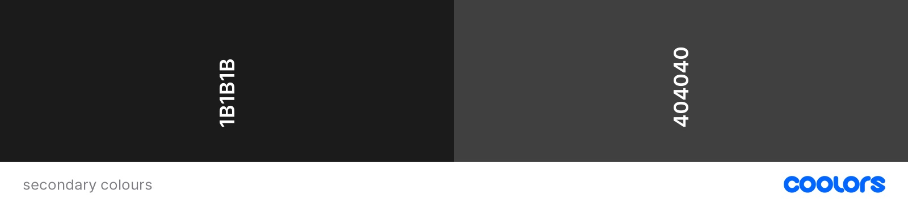

# **Mystic Hazel's Memory Magic** <!-- omit in toc -->

This is the documentation for Mystic Hazel's Memory Magic. A memory game designed for children, set in a whimsical world of magic and wonder. Aid the charming character Mystic Hazel on her quest to create a memory-boosting potion, and perhaps improve your own memory along the way.

The project was created as part of the Code Institute Level 5 Diploma in Web Application Development course.

[Click here to play Mystic Hazel's Memory Magic](https://andywright360.github.io/Mystic-Hazels-Memory-Magic/)

**By Andrew Wright**

---

## **Contents** <!-- omit in toc -->

- [**User Experience (UX)**](#user-experience-ux)
  - [**Initial Concept**](#initial-concept)
  - [**User Stories**](#user-stories)
- [**Design**](#design)
  - [**Colour Scheme**](#colour-scheme)
    - [**Primary Palette**](#primary-palette)
    - [**Additional Colours**](#additional-colours)
  - [**Typography**](#typography)
    - [**Black Pearl**](#black-pearl)
    - [**Fondamento**](#fondamento)
  - [**Imagery**](#imagery)
  - [**Wireframes**](#wireframes)
    - [**Desktop**](#desktop)
    - [**Tablet**](#tablet)
    - [**Mobile**](#mobile)
    - [**Modals**](#modals)
- [**Features**](#features)
  - [**General Features**](#general-features)
    - [**Responsive Design**](#responsive-design)
    - [**Images**](#images)
  - [**Future Implementations**](#future-implementations)
- [**Technologies Used**](#technologies-used)
  - [**Languages Used**](#languages-used)
  - [**Frameworks, Libraries \& Programs Used**](#frameworks-libraries--programs-used)
- [**Deployment \& Local Development**](#deployment--local-development)
  - [**Deployment**](#deployment)
  - [**Local Development**](#local-development)
    - [**How to Fork**](#how-to-fork)
    - [**How to Clone**](#how-to-clone)
- [**Testing**](#testing)
  - [**W3C HTML Validation**](#w3c-html-validation)
  - [**W3C CSS Validation**](#w3c-css-validation)
  - [**WCAG Colour Contrast Checker**](#wcag-colour-contrast-checker)
  - [**Bugs \& Fixes**](#bugs--fixes)
  - [**Known Bugs**](#known-bugs)
  - [**Testing User Stories**](#testing-user-stories)
    - [**First Time Visitor Goals**](#first-time-visitor-goals)
    - [**Returning Visitor Goals**](#returning-visitor-goals)
    - [**Frequent User Goals**](#frequent-user-goals)
  - [**Lighthouse Testing**](#lighthouse-testing)
  - [**Manual Testing**](#manual-testing)
- [**Credits**](#credits)
  - [**Code Used**](#code-used)
  - [**Content**](#content)
  - [**Media**](#media)
  - [**Acknowledgments**](#acknowledgments)

---

## **User Experience (UX)**

### **Initial Concept**

The idea for the project was to develop a memory game targeted towards children. The concept was to create a loveable character that needed the users help. This was to encourage the users to play the game and hopefully increase their enjoyment of it.

The visual design was to give the impression of the game being played on a witch's work desk. The game window is displayed on an open spell book and is intended to be from the user's perspective.

I included a scoring system to provide greater replayability and entice players to return and improve their scores.

### **User Stories**

- **First Time Visitor Goals**

  1. Understand the rules of the game so I can play without confusion.
  2. I want the page to be responsive so I can play it on the device of my choosing.
  3. I want to be introduced to the character and story of the game.

- **Returning Visitor Goals**

  1. Keep track of my previous scores so I can monitor my improvement.

- **Frequent User Goals**

  1. Challenge myself to achieve the highest score possible.
  2. Follow the games social media accounts.

---

## **Design**

### **Colour Scheme**

#### **Primary Palette**

The colour palette used throughout the project was primarily purples combined with greens. These colours were selected as they're a typical used as a Halloween theme.

With the main character of the game being a witch, I wanted to lean into this theme as much as possible. The specific palette matches colours used for the image of Hazel. This was to connect the character with the world of the game.

#### **Additional Colours**

These additional colours were used for the page text and also the footer. The design of the footer was to resemble a witch's cauldron. I wanted the greens used in the footer to have a strong contrast to the background.

### **Typography**

#### **Black Pearl**

Black Pearl was the font used for the main heading of the page and also the headings for the modals. This font was chosen to invoke the idea of a folktale for the game. I wanted the design to have the charm of a children's book.

#### **Fondamento**

Fondamento was used for all text and headings throughout the page. Again, the style chosen was to further the folktale look. With the content of the page being overlaid onto an open book. The idea was that the page content was handwritten.

At the same time, I wanted the font to maintain readability for the user even at the smallest font size used.

### **Imagery**

The imagery used, was to reinforce the cartoon style of the world. Everything was to be brightly coloured and compliment the colour palette of the page. I modified the colour for some images using Pixlr in order to better suit the theme.

The design concept for the page was to be from the players perspective, looking down onto Hazel's workbench. To visually represent this, all images chosen were from a birds-eye view.

Other colours, such as orange were also included using the images. This was to include additional colours typically used for a Halloween theme.

### **Wireframes**

All wireframes were created using Balsamiq for the following screen sizes:

#### **Desktop**

Home Page

*Home Page*

How To Play Page

*How To Play Page*

Game Page

*Game Page*

High Scores Page

*High Scores Page*

#### **Tablet**

Home Page

*Home Page*

How To Play Page

*How To Play Page*

Game Page

*Game Page*

High Scores Page

*High Scores Page*

#### **Mobile**

Home Page

*Home Page*

How To Play Page

*How To Play Page*

Game Page

*Game Page*

High Scores Page

*High Scores Page*

#### **Modals**

Win Game Modal

*Win Game Modal*

Lose Game Modal

*Lose Game Modal*

---

## **Features**

### **General Features**

#### **Responsive Design**

#### **Images**

### **Future Implementations**

---

## **Technologies Used**

### **Languages Used**

- HTML5
- CSS3
- JavaScript

### **Frameworks, Libraries & Programs Used**

---

## **Deployment & Local Development**

### **Deployment**

The project was deployed to GitHub Pages. The following steps were used to achieve this:

1. Log in to GitHub.

2. Locate the relevant repository for this project (Mystic-Hazels-Memory-Magic).

3. Select the '**Settings**' tab for the chosen repository at the top of the page.

4. Click on the '**Pages**' tab from the left-hand navigation menu.

5. Under '**Source**' click the drop-down menu and select the option '**Deploy from a branch**'.

6. In the '**Branch**' section, click the farthest left drop-down menu box and select the option '**main**'. Select the drop-down menu box next to this and choose the option '**/(root)**'.

7. Click the '**Save**' button.

8. The live site address will display when successfully published.

### **Local Development**

#### **How to Fork**

Forking the the GitHub Repository allows for changes to be made without altering the original repository. To do this please follow the following steps:

1. Log in to GitHub.

2. Locate the relevant repository for this project (Mystic-Hazels-Memory-Magic).

3. Select the '**Fork**' button located towards the top right of the repository.

4. You should now have a copy of the original repository in your GitHub account.

#### **How to Clone**

To clone this project, please follow the steps below:

1. Log in to GitHub.

2. Locate the relevant repository for this project (Mystic-Hazels-Memory-Magic).

3. Click on the green '**Code**' drop-down button.

4. Select the '**Local**' tab in the window that appears.

5. Select the option '**HTTPS**' and copy the link shown.

6. Open the terminal in your IDE of choice.

7. Change the current working directory to the location you want to use for the cloned directory.

8. Type '**git clone**' into the terminal and then paste the link you copied in Step 5.

9. Press enter.

---

## **Testing**

### **W3C HTML Validation**

### **W3C CSS Validation**

### **WCAG Colour Contrast Checker**

### **Bugs & Fixes**

### **Known Bugs**

### **Testing User Stories**

#### **First Time Visitor Goals**

#### **Returning Visitor Goals**

#### **Frequent User Goals**

### **Lighthouse Testing**

### **Manual Testing**

---

## **Credits**

### **Code Used**

### **Content**

### **Media**

### **Acknowledgments**
