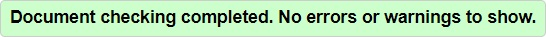
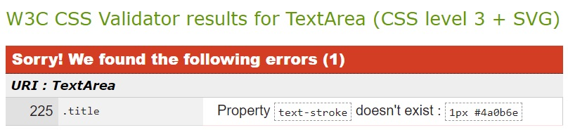

# **Mystic Hazel's Memory Magic - Testing** <!-- omit in toc -->

[Click here to play Mystic Hazel's Memory Magic](https://andywright360.github.io/Mystic-Hazels-Memory-Magic/)

**By [Andrew Wright](https://github.com/AndyWright360)**

---

## **Contents** <!-- omit in toc -->

- [**Testing**](#testing)
  - [**W3C HTML Validation**](#w3c-html-validation)
  - [**W3C CSS Validation**](#w3c-css-validation)
  - [**JSHint JavaScript Validation**](#jshint-javascript-validation)
  - [**WCAG Colour Contrast Checker**](#wcag-colour-contrast-checker)
  - [**Bugs \& Fixes**](#bugs--fixes)
  - [**Known Bugs**](#known-bugs)
  - [**Testing User Stories**](#testing-user-stories)
    - [**First Time Visitor Goals**](#first-time-visitor-goals)
    - [**Returning Visitor Goals**](#returning-visitor-goals)
    - [**Frequent User Goals**](#frequent-user-goals)
  - [**Lighthouse Testing**](#lighthouse-testing)
  - [**Manual Testing**](#manual-testing)

---

## **Testing**

### **W3C HTML Validation**

[W3C](https://validator.w3.org/) was used to validate the HTML code.

- index.html - Passed

### **W3C CSS Validation**

[W3C](https://jigsaw.w3.org/css-validator/) was used to validate the CSS code.

- style.css - (1) Error and (10) Warnings

*Error*

*Warnings*

The error detecteacted refers to the use of `text-stroke` which was applied to the 

### **JSHint JavaScript Validation**

### **WCAG Colour Contrast Checker**

### **Bugs & Fixes**

### **Known Bugs**

### **Testing User Stories**

#### **First Time Visitor Goals**

#### **Returning Visitor Goals**

#### **Frequent User Goals**

### **Lighthouse Testing**

### **Manual Testing**
