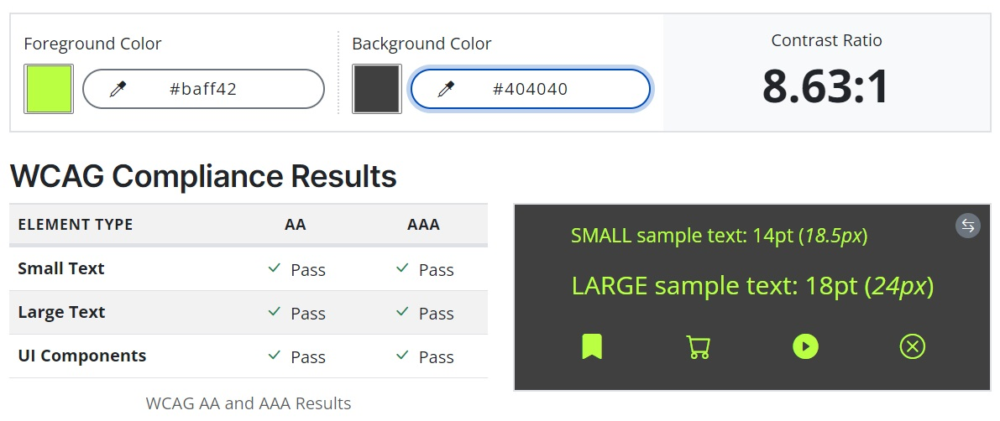

# **Mystic Hazel's Memory Magic - Testing** <!-- omit in toc -->


[Click here to play Mystic Hazel's Memory Magic](https://andywright360.github.io/Mystic-Hazels-Memory-Magic/)

**By [Andrew Wright](https://github.com/AndyWright360)**

---

## **Contents** <!-- omit in toc -->

- [**Automated Testing**](#automated-testing)
  - [**W3C HTML Validation**](#w3c-html-validation)
  - [**W3C CSS Validation**](#w3c-css-validation)
    - [**Second Validation Test**](#second-validation-test)
  - [**JSHint JavaScript Validation**](#jshint-javascript-validation)
  - [**WCAG Colour Contrast Checker**](#wcag-colour-contrast-checker)
    - [**Page Content**](#page-content)
    - [**Score Display**](#score-display)
    - [**Buttons**](#buttons)
    - [**Footer Content**](#footer-content)
  - [**Lighthouse Testing**](#lighthouse-testing)
    - [**Desktop Results**](#desktop-results)
    - [**Mobile Results**](#mobile-results)
- [**Manual Testing**](#manual-testing)
  - [**Testing User Stories**](#testing-user-stories)
    - [**First Time Visitor Goals**](#first-time-visitor-goals)
    - [**Returning Visitor Goals**](#returning-visitor-goals)
    - [**Frequent User Goals**](#frequent-user-goals)
  - [**Full Testing**](#full-testing)

---

## **Automated Testing**

### **W3C HTML Validation**

[W3C](https://validator.w3.org/) was used to validate the HTML code.

- index.html - Passed


### **W3C CSS Validation**

[W3C](https://jigsaw.w3.org/css-validator/) was used to validate the CSS code.

- style.css - (1) Error and (10) Warnings


*Error*


*Warnings*

The error detected refers to the use of an incorrect CSS property `text-stroke` which was applied to the `.title` class. This property must be pre-fixed with `-webkit-` in order to be valid as this is a non-standard CSS property.

#### **Second Validation Test**

In order to correct this error, I removed the property from the `.title` class. The results from the second validation were a pass.


*Pass*

### **JSHint JavaScript Validation**

[JSHint](https://jshint.com/) was used to validate the JavaScript code.

- script.js - (107) Warnings


*Results*

The warnings referred to the use of ES6 features throughout the file. These features include:

 - The 'let' keyword
 - The 'const' keyword
 - Arrow functions
 - The spread operator

The other warning that I received, outlined the use of a function declared within a loop that references an outer scoped variable.

```
// Display top player names on the High Scores page
const displayHighScores = () => {
  // Get the current top scores
  retrieveStoredScores();

  // Clear the existing topPlayers list
  topPlayers.innerHTML = "";

  // Add the top player names to the list
  for (let m = 0; m < topScores.length; m++) {
    let player = document.createElement("li");
    player.textContent = topScores[m].name;

    // Add interactive elements to the list items
    player.addEventListener("mouseenter", underline);
    player.addEventListener("mouseleave", removeUnderline);
    player.addEventListener("click", () => {
      showPlayerScore(topScores[m]);

      // Remove bold font class from previously selected player
      const previousSelectedPlayer = document.querySelector(".selected-player");
      if (previousSelectedPlayer) {
        previousSelectedPlayer.classList.remove("selected-player");
      }

      // Add bold font class to the clicked player
      player.classList.add("selected-player");
    });
    topPlayers.appendChild(player);

    // Display the top player's score by default
    if (m === 0) {
      showPlayerScore(topScores[0]);
      player.classList.add("selected-player");
    }
  }
};
```

The warning pertains to the `displayHighScores` function, which iterates through an array of recorded top players. For each item in the top players array, an `li` element is created. Within this loop, a `click` event listener is attached to the created element.

When the `li` element is clicked, the details of the clicked player's corresponding object are passed as an argument to the `showPlayerScore` function. This allows the `showPlayerScore` function to display the score information of the player who triggered the event.

This was the only method I could think of that would allow me to pass the specific players information as an argument to another function.

### **WCAG Colour Contrast Checker**

I paid close attention to achieving a strong contrast while choosing the color scheme for the website. The outcomes of each background and foreground combination employed in this project are detailed below.

#### **Page Content**


With the text colour close to black and the book pages being light, the contrast ratio was very high. The only potential issue that could arise is from the fact that the container for the text content is an image. If this fails to load, then the text would be overlaid onto the background image for the body, which is considerably darker.

With the image having transparent edges, I was reluctant to add a background color to the container as this would be visible. However, this is something I would look to rectify in future iterations to avoid any potential issues with legibility.

#### **Score Display**


This is the contrast results for the timer countdown and player turn count.

#### **Buttons**


*Buttons - Default*


*Buttons - Hover*

These are the contrast results for the buttons and the hover effect applied to them.

#### **Footer Content**



This is the contrast for the social media links and copyright information displayed on the footer.

### **Lighthouse Testing**

Lighthouse within Chrome Developer Tools was used to assess the website's performance, accessibility, adherence to best practices, and SEO.

#### **Desktop Results**


#### **Mobile Results**


---

## **Manual Testing**

### **Testing User Stories**

#### **First Time Visitor Goals**

| Goals | How are they achieved? |
| :--- | :--- |
| I want to understand the rules of the game so I can play without confusion. | The `How To Play` navigation button directs users to a comprehensive tutorial explaining the game mechanics, winning strategies, and valuable tips. |
| I want the page to be responsive so I can play it on the device of my choosing. | The page was designed with responsiveness in mind, employing a mobile-first approach. This ensures a consistent user experience across various devices. |
| I want to be introduced to the character and story of the game. | The home page features a prominent image introducing the main character, Hazel. The story unfolds on the image of an open book, inviting users to explore the game's backstory. |

#### **Returning Visitor Goals**

| Goals | How are they achieved? |
| :--- | :--- |
| I want to keep track of my previous scores so I can monitor my improvement. | Upon submitting a player's score, the data is stored using local storage. This functionality enables users to revisit the page at any time, with their score data retained, as long as the same device is used. |

#### **Frequent User Goals**

| Goals | How are they achieved? |
| :--- | :--- |
| I want to challenge myself to achieve the highest score possible. | The scoring system implemented challenges users to complete the game within a specified time to achieve the highest score. This can be further improved by reducing the number of turns used. This combination allows frequent users to compete against their best scores. |
| I want to follow the games social media accounts. | Links to the game's social media accounts are displayed within the footer. Each link redirects the user to the specified page, enabling easy access to follow the requested account. |

### **Full Testing**

Full testing was performed on the following devices:

- Laptop:
  - MSI Thin GF63 15 inch screen
- Mobile Device:
  - iPhone XR

The following browsers were tested using each device:

- Laptop:
  - Google Chrome
  - Microsoft Edge
  - Mozilla Firefox
- Mobile:
  - Safari

Friends and family also tested the website using a variety of devices. No issues were reported.


