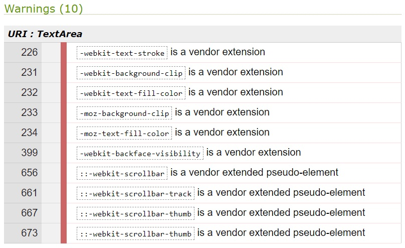

# **Mystic Hazel's Memory Magic - Testing** <!-- omit in toc -->


[Click here to play Mystic Hazel's Memory Magic](https://andywright360.github.io/Mystic-Hazels-Memory-Magic/)

**By [Andrew Wright](https://github.com/AndyWright360)**

---

## **Contents** <!-- omit in toc -->

- [**Testing**](#testing)
  - [**W3C HTML Validation**](#w3c-html-validation)
  - [**W3C CSS Validation**](#w3c-css-validation)
  - [**JSHint JavaScript Validation**](#jshint-javascript-validation)
  - [**WCAG Colour Contrast Checker**](#wcag-colour-contrast-checker)
  - [**Bugs \& Fixes**](#bugs--fixes)
  - [**Known Bugs**](#known-bugs)
  - [**Testing User Stories**](#testing-user-stories)
    - [**First Time Visitor Goals**](#first-time-visitor-goals)
    - [**Returning Visitor Goals**](#returning-visitor-goals)
    - [**Frequent User Goals**](#frequent-user-goals)
  - [**Lighthouse Testing**](#lighthouse-testing)
  - [**Manual Testing**](#manual-testing)

---

## **Testing**

### **W3C HTML Validation**

[W3C](https://validator.w3.org/) was used to validate the HTML code.

- index.html - Passed


### **W3C CSS Validation**

[W3C](https://jigsaw.w3.org/css-validator/) was used to validate the CSS code.

- style.css - (1) Error and (10) Warnings


*Error*



*Warnings*

The error detected refers to the use of an incorrect CSS property `text-stroke` which was applied to the `.title` class. This property must be pre-fixed with `-webkit-` in order to be valid as this is a non-standard CSS property.

In order to correct this error, I removed the property from the class.

### **JSHint JavaScript Validation**

[JSHint](https://jshint.com/) was used to validate the JavaScript code.

- script.js - (107) Warnings


*Results*

The warnings pertained to use of ES6 features used throught my file. These included:

 - The 'let' keyword
 - The 'const' keyword
 - Arrow functions
 - The spread operator

The other warning that I received, outlined the use of a function declared within a loop that references an outer scoped variable.

```
// Display top player names on the High Scores page
const displayHighScores = () => {
  // Get the current top scores
  retrieveStoredScores();

  // Clear the existing topPlayers list
  topPlayers.innerHTML = "";

  // Add the top player names to the list
  for (let m = 0; m < topScores.length; m++) {
    let player = document.createElement("li");
    player.textContent = topScores[m].name;

    // Add interactive elements to the list items
    player.addEventListener("mouseenter", underline);
    player.addEventListener("mouseleave", removeUnderline);
    player.addEventListener("click", () => {
      showPlayerScore(topScores[m]);

      // Remove bold font class from previously selected player
      const previousSelectedPlayer = document.querySelector(".selected-player");
      if (previousSelectedPlayer) {
        previousSelectedPlayer.classList.remove("selected-player");
      }

      // Add bold font class to the clicked player
      player.classList.add("selected-player");
    });
    topPlayers.appendChild(player);

    // Display the top player's score by default
    if (m === 0) {
      showPlayerScore(topScores[0]);
      player.classList.add("selected-player");
    }
  }
};
```

The warning pertains to the `displayHighScores` function, which iterates through an array of recorded top players. For each item in the top players array, an `li` element is created. Within this loop, a `click` event listener is attached to the created element.

When the `li` element is clicked, the details of the clicked player's corresponding object is passed as an argument to the `showPlayerScore` function. This allows the `showPlayerScore` function to display the score information of the player who triggered the event.

This was the only method I could think of that would allow me to pass the specific players information as an argument to another function.

### **WCAG Colour Contrast Checker**


### **Bugs & Fixes**

### **Known Bugs**

### **Testing User Stories**

#### **First Time Visitor Goals**

#### **Returning Visitor Goals**

#### **Frequent User Goals**

### **Lighthouse Testing**

### **Manual Testing**
